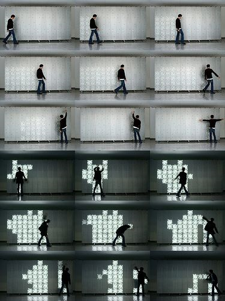
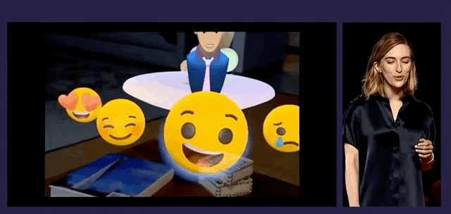
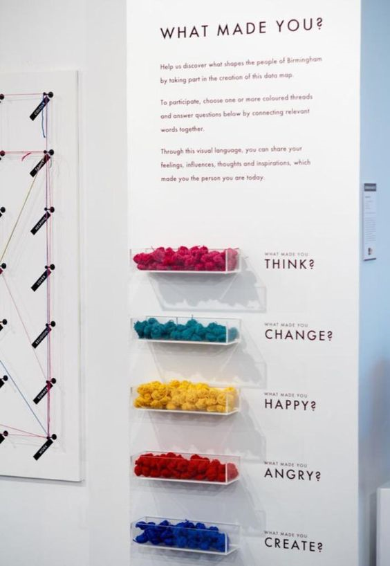
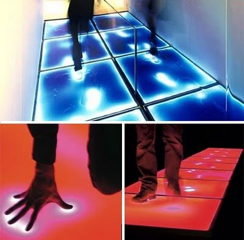
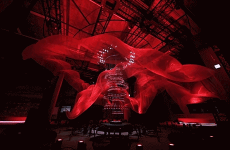

# 2/1/2019
**Author**: S1842214 / [Yue Qiu](https://github.com/Joyyyyyyyy)

## Topics and Researches

The first group meeting, we were talking about several topics which we are interested in.

I was interested in two topic and did some researches:
1.	According the festival map, which can display the visualization of visitors’ emotion.

    Installation:  interaction reaction, motion capture

    Concept: let abstract become concrete. For example, detect heartbeat of audiences, facial expression, in the end, installation could create unique shape or pattern of every audience.
    
    

    eg.the intensity intension of gauze flowing represent the heatbeat

2.	According the festival area’ sound to display sound visualization.

    We need to collect the area’s sound API and get phones microphone’s jurisdiction limits of authority, it may be hard to achieve.

## Triangulation

