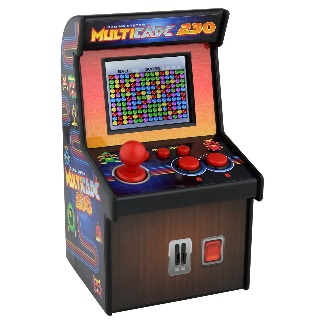
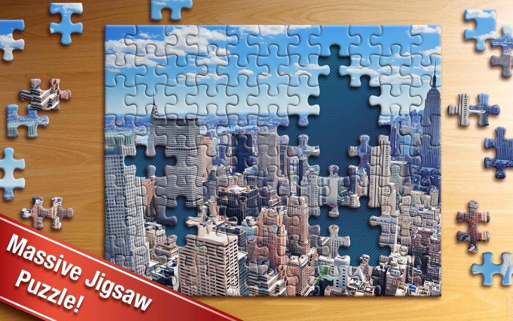

# 2/9/2019

**Author**: S1842214 / [Yue Qiu]((https://github.com/Joyyyyyyyy))

In this group meeting, we were continue to think about the choice anxiety. 

## Purpose of Project

We discussed about the form of installation, at first, we should consider about physicalization of the questionnaire survey, and the goal is:
1.	let audiences to feel an immersive environment;
2.	Reduce the feeling of filling something like survey or form;
3.	It will has the function in term of the festival propaganda;
4.	The installation maybe has some characters of festival or city.

 
## Essential Data of Participants

And then we were thinking some essential questions of the “survey”, for example, time, location, popularity, language, the number of people.

I was thinking about some interesting form of filling the questionnaire. Like a real game machine or puzzle jigsaw. 

  
In my opinion, I was thinking about a ball could be touch, and it can help audiences to change the colour of ball, the music of background, in the end, put the ball on the button, the final choice of event will be display on the wall or screen.

## Reference
1. Carl Gustav Jung and the psychobiology of schizophrenia. Frank A. Greco and Curtis K. Deutsc,
Annual Review of Psychology.
2. The Psychology of Music: Rhythm and Movement. Daniel J. Levitin, Jessica A. Grahn, and Justin London
3. Color Psychology: Effects of Perceiving Color on Psychological Functioning in Humans
Andrew J. Elliot and Markus A. Maier